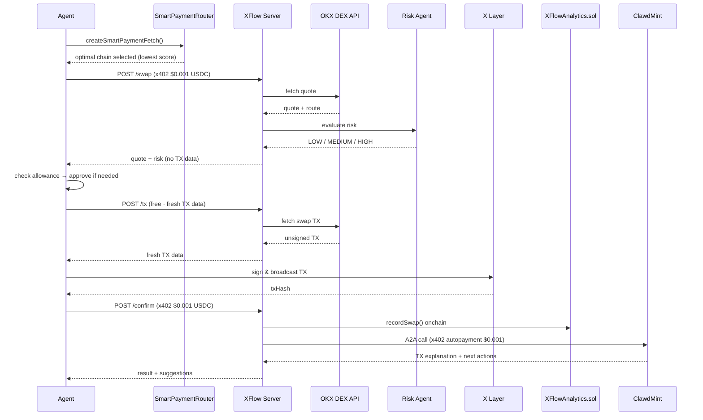

# XFlow — AI Agent Payment Infrastructure on X Layer

> **AI agents that pay each other. No API keys. No subscriptions. No humans in the loop.**

XFlow is a production-deployed multi-agent system where AI agents autonomously execute DeFi swaps on X Layer, pay for services using x402 micropayments ($0.001 USDC/call), and consult external AI agents — all without human intervention. Every payment, swap, and agent-to-agent call is recorded onchain.

**[🎬 Demo Video](#)** · **[📊 Live Dashboard](#)** · **[📦 GitHub](https://github.com/cryptohakka/xflow)**

---

## The Problem

Today's AI agents can reason, plan, and act — but they can't pay. Every API they call requires a human to set up an API key, subscribe to a plan, and manage billing. This is a fundamental bottleneck for autonomous agent systems.

**The result:** Agents that need a human babysitter for every dollar they spend.

---

## What XFlow Does

XFlow is the payment and execution layer for AI agents operating in DeFi. An agent sends a natural language swap request, pays $0.001 USDC automatically from whichever chain scores best, and gets back an executed trade on X Layer — with post-swap analysis from a second AI agent that also gets paid automatically.

```
Agent says:  "swap 0.01 USDC to USDT0"
             ↓
XFlow:       Selects optimal payment chain in 796ms
             Pays $0.001 USDC via x402
             Quotes + risk checks the swap
             Executes on X Layer via OKX DEX Aggregator
             Pays ClawdMint AI $0.001 for TX analysis
             Returns result + next action suggestions
             Records everything onchain
```

No API keys. No subscriptions. No humans.

---

## Live Stats (Onchain · X Layer)

| Metric | Value |
|--------|-------|
| Unique AI Agents | 3 |
| Total Swaps Executed | 23 |
| Total x402 Payments | 61 |
| A2A Calls (Agent→Agent) | 22 |
| Total Fees Earned | $0.061 |
| Avg. Decision Latency | 796ms |
| Execution Success Rate | 100% |
| Avg. Slippage | 0.065% |

*All data verifiable onchain via [XFlowAnalytics.sol](https://www.okx.com/web3/explorer/xlayer/address/0xf88A47a15fAa310E11c67568ef934141880d473e)*

---

## The Core Innovation: Three Layers Working Together

### 1. x402 — HTTP-Native Micropayments

x402 turns API access into a pay-per-use primitive. When an agent calls `POST /swap`, the server returns HTTP 402 with payment requirements. The agent's wallet signs a USDC transfer, and the request proceeds automatically — no API keys, no OAuth, no billing portal.

```
Agent → POST /swap
Server ← 402 Payment Required (USDC · any of 4 chains)
Agent → POST /swap + x402 payment header
Server ← 200 OK + swap result
```

XFlow accepts x402 payments on **4 chains simultaneously**: X Layer, Base, Polygon, Avalanche.

### 2. SmartPaymentRouter — Optimal Chain Selection

Paying on the wrong chain wastes money and time. SmartPaymentRouter scans USDC balances across all supported chains and selects the optimal one using a composite score:

```
score = gasCost + finality × $0.0001/s
```

Lower score = better route. An agent with USDC on Avalanche pays ~$0.000025 in gas vs ~$0.001315 on Base — a **52x difference**. SmartPaymentRouter makes this decision automatically, every time.

```
⛽ Estimating gas costs...
   Polygon:   $0.001168 gas · 5s finality   → score $0.001668
   Base:      $0.001315 gas · 2s finality   → score $0.001515
   X Layer:   $0.000089 gas · 1s finality   → score $0.000189
   Avalanche: $0.000025 gas · 0.8s finality → score $0.000105  ✓ selected
```

**This also benefits the x402 facilitator.** The facilitator is a third-party service that settles x402 payments onchain on behalf of agents — absorbing the gas cost of every settlement. By routing payments to the cheapest chain, SmartPaymentRouter reduces the facilitator's gas burden across the entire ecosystem:

```
Without SmartRouting:
  10,000 agent payments/day × $0.005 avg settlement gas = $50/day facilitator cost

With SmartRouting:
  10,000 agent payments/day × $0.002 avg settlement gas = $20/day facilitator cost

  → 60% cost reduction for the facilitator
  → More sustainable infrastructure for the agent economy at scale
```

SmartPaymentRouter is a systemic improvement — not just a per-agent optimization.

### 3. Agent-to-Agent (A2A) — Agents Paying Agents

After each confirmed swap, XFlow autonomously calls **ClawdMint** — an external AI agent — via the A2A protocol (JSON-RPC 2.0 / ERC-8004). XFlow pays ClawdMint $0.001 USDC using x402, receives a TX explanation and next-action suggestions, and passes them back to the caller.

This is the complete agentic payment loop: **human → agent → agent → agent**, with every hop paid automatically and recorded onchain.

```
User Agent
    │  x402 $0.001 (Avalanche)
    ▼
XFlow Orchestrator
    │  parallel dispatch
    ├──▶ DEX Agent (OKX Aggregator)
    ├──▶ Risk Agent (slippage guard)
    └──▶ Analytics Agent (onchain record)
    │
    │  agent0-sdk + x402 $0.001 (Base)
    ▼
ClawdMint (external AI · swap confirmation)
```

---

## Architecture

```
External Agent / User
        │
        │  x402 payment ($0.001 USDC · optimal chain selected automatically)
        ▼
┌─────────────────────────┐
│   Smart Payment Router  │  ← score = gasCost + finality × $0.0001/s
│   x402 Payment Adapter  │  ← handles 402 handshake transparently
└────────────┬────────────┘
             │
             ▼
┌─────────────────────────┐
│      Orchestrator       │  ← LLM intent parsing (Gemini 2.5 Flash Lite)
└────────────┬────────────┘
             │
     ┌───────┴───────┐
     ▼               ▼
┌─────────┐   ┌─────────────┐
│  Risk   │   │  DEX Agent  │  ← OKX DEX Aggregator API
│  Agent  │   │             │  ← unsigned swap TX on X Layer
└────┬────┘   └──────┬──────┘
     └───────┬───────┘
             ▼
    Agent signs & broadcasts on X Layer
             │
             ▼  POST /confirm
     ┌───────┴────────────────┐
     ▼                        ▼
┌──────────────────┐  ┌──────────────────────┐
│ Analytics Agent  │  │  ClawdMint A2A Agent │  ← x402 autopayment
│ XFlowAnalytics   │  │  TX explanation      │  ← next action suggestions
│ .sol (X Layer)   │  └──────────────────────┘
└──────────────────┘
```

---

## Sequence Diagram



---

## Source Structure

```
src/
├── server.ts               # Express server — /swap, /tx, /confirm, /dashboard
├── smartPaymentRouter.ts   # Chain selection: score = gasCost + finality × $0.0001/s
├── orchestrator.ts         # LLM intent parsing (Gemini 2.5 Flash Lite)
├── riskAgent.ts            # Risk evaluation — price impact + route quality
├── dexAgent.ts             # OKX DEX Aggregator — quote + TX data
├── tokenResolver.ts        # Token address resolution
├── analyticsAgent.ts       # Onchain swap + x402 + A2A recording
├── clawdmintA2A.ts         # A2A + x402 call to ClawdMint (agent0-sdk)
├── contracts/
│   └── XFlowAnalytics.sol  # Analytics contract (deployed · X Layer)
└── public/
    └── dashboard.html      # Real-time dashboard
```

---

## Quick Start

### Run XFlow Server

```bash
git clone https://github.com/cryptohakka/xflow
cd xflow
cp .env.example .env
# Fill in: PRIVATE_KEY, OKX_API_KEY, OKX_SECRET_KEY, OKX_PASSPHRASE,
#          OPENROUTER_API_KEY, PAYEE_ADDRESS, PAYAI_API_KEY_ID, PAYAI_API_KEY_SECRET
docker compose up -d
```

Dashboard: `http://localhost:3010`

> **Security:** Use a dedicated wallet with minimal funds. Never commit `.env` to version control.

### Call XFlow as an Agent

```typescript
import { createSmartPaymentFetch } from './src/smartPaymentRouter.js';
import { createWalletClient, http } from 'viem';
import { privateKeyToAccount } from 'viem/accounts';

// SmartPaymentRouter auto-selects optimal chain
const { fetchWithPayment, selectedNetwork } = await createSmartPaymentFetch(PRIVATE_KEY);

// POST /swap — x402 payment + quote + risk assessment
const swapRes = await fetchWithPayment('http://localhost:3010/swap', {
  method: 'POST',
  headers: { 'Content-Type': 'application/json' },
  body: JSON.stringify({
    query: 'swap 0.01 USDC to USDT0',
    userAddress: '0x...',
  }),
});
const { result } = await swapRes.json();
const quote = result.data.quote;

// POST /tx — fresh TX data right before broadcast (avoids quote expiry)
const txRes = await fetch('http://localhost:3010/tx', {
  method: 'POST',
  headers: { 'Content-Type': 'application/json' },
  body: JSON.stringify({
    query: 'swap 0.01 USDC to USDT0',
    userAddress: '0x...',
    fromTokenAddress: quote.fromTokenAddress,
    toTokenAddress: quote.toTokenAddress,
  }),
});
const { result: txResult } = await txRes.json();
const tx = txResult.data.result.tx;

// Agent signs & broadcasts (requires OKB on X Layer for gas)
const walletClient = createWalletClient({ account, chain: xlayer, transport: http() });
const txHash = await walletClient.sendTransaction({
  to: tx.to, data: tx.data,
  gas: BigInt(Math.floor(Number(tx.gas) * 1.5)),
  gasPrice: BigInt(tx.gasPrice),
  chainId: 196,
});

// POST /confirm — triggers Analytics + ClawdMint A2A automatically
const confirmRes = await fetchWithPayment('http://localhost:3010/confirm', {
  method: 'POST',
  headers: { 'Content-Type': 'application/json' },
  body: JSON.stringify({
    txHash,
    fromToken: quote.fromToken,
    toToken: quote.toToken,
    fromAmount: quote.fromAmount,
    toAmount: quote.toAmount,
    paymentNetwork: selectedNetwork.network,
    route: quote.route,
    riskLevel: result.data.risk.riskLevel,
    agentAddress: account.address,
  }),
});
const { clawdmint } = await confirmRes.json();
// clawdmint.txExplanation  — AI analysis of the swap
// clawdmint.nextActions    — suggested next moves
```

---

## API Reference

### `POST /swap` — x402 protected · $0.001 USDC

Returns quote and risk assessment. Does **not** include TX data — call `/tx` right before broadcast.

```json
// Request
{ "query": "swap 0.01 USDC to USDT0", "userAddress": "0x..." }

// Response
{
  "success": true,
  "decisionMs": 796,
  "result": {
    "intent": { "action": "swap", "fromToken": "USDC", "toToken": "USDT0", "amount": "0.01" },
    "data": {
      "risk": { "riskLevel": "LOW", "approved": true },
      "quote": {
        "fromToken": "USDC", "toToken": "USDT0",
        "fromAmount": "0.01", "toAmount": "0.010016",
        "route": "OkxStableSwap", "priceImpact": "0.00%"
      }
    }
  }
}
```

### `POST /tx` — free · call immediately before broadcast

Fetches fresh TX data. Call **after** approve, **immediately** before broadcast.

```json
// Request
{
  "query": "swap 0.01 USDC to USDT0",
  "userAddress": "0x...",
  "fromTokenAddress": "0x74b7...",
  "toTokenAddress": "0x1e4a..."
}

// Response
{
  "success": true,
  "result": { "data": { "result": {
    "tx": { "to": "0xD1b8...", "data": "0x...", "gas": "930231", "gasPrice": "20000001", "chainId": 196 }
  }}}
}
```

### `POST /confirm` — x402 protected · $0.001 USDC

Records swap onchain and triggers ClawdMint A2A analysis.

```json
// Request
{
  "txHash": "0x...", "fromToken": "USDC", "toToken": "USDT0",
  "fromAmount": "0.01", "toAmount": "0.010016",
  "paymentNetwork": "eip155:43114", "route": "OkxStableSwap",
  "riskLevel": "LOW", "agentAddress": "0x..."
}

// Response
{
  "success": true,
  "analyticsTx": "0x...",
  "clawdmint": {
    "txExplanation": "Swapped 0.01 USDC for 0.010016 USDT0 via OkxStableSwap on X Layer...",
    "nextActions": "Deploy USDT0 to USDT0/WOKB pool on Uniswap X Layer",
    "paidWithX402": true,
    "note": "Powered by ClawdMint via A2A + x402"
  }
}
```

### `GET /dashboard` — free

Real-time analytics from XFlowAnalytics.sol. Includes `avgDecisionMs` and `totalGasSavedUSD` from session memory.

### `GET /health` — free

```json
{ "status": "ok", "service": "XFlow", "version": "0.1.0" }
```

---

## Risk Agent Logic

Every swap is evaluated before execution. Source: [`src/riskAgent.ts`](./src/riskAgent.ts)

| Factor | Score 0 | Score 1 | Score 2 | Score 3 | Score 4 |
|--------|---------|---------|---------|---------|---------|
| Price impact | ≤ 0% | < 0.1% | 0.1–0.5% | 0.5–2% | > 2% |
| Route quality | Known DEX | — | Unknown route | — | — |

```
finalScore = max(priceImpactScore, routeScore)

≥ 4  → HIGH    → rejected + recorded onchain
≥ 2  → MEDIUM  → approved with warning
< 2  → LOW     → approved
```

HIGH and UNKNOWN swaps are rejected before TX generation. All rejections recorded via `recordFailedSwap()`.

---

## Gas Model

XFlow has two distinct gas surfaces:

| Step | Gas required | Paid by | Chain |
|------|-------------|---------|-------|
| `POST /swap` API call | No | x402 facilitator (USDC) | Any supported chain |
| `POST /confirm` API call | No | x402 facilitator (USDC) | Any supported chain |
| Swap TX broadcast | **Yes (OKB)** | Calling agent | X Layer |
| Analytics record | Yes (OKB) | XFlow server wallet | X Layer |
| ClawdMint A2A call | No (x402 USDC) | XFlow server wallet | Base |

**Summary:** Calling XFlow costs only USDC — no gas token needed for API calls. The actual swap execution on X Layer requires a small amount of OKB.

---

## Supported Payment Networks (x402)

| Chain | Network ID | USDC Address | Finality |
|-------|-----------|------|----------|
| X Layer | `eip155:196` | `0x74b7f16337b8972027f6196a17a631ac6de26d22` | ~1s |
| Base | `eip155:8453` | `0x833589fCD6eDb6E08f4c7C32D4f71b54bdA02913` | ~2s |
| Polygon | `eip155:137` | `0x3c499c542cEF5E3811e1192ce70d8cC03d5c3359` | ~5s |
| Avalanche | `eip155:43114` | `0xB97EF9Ef8734C71904D8002F8b6Bc66Dd9c48a6E` | ~0.8s |

---

## Onchain Contracts (X Layer)

| Contract | Address | Explorer |
|----------|---------|---------|
| XFlowAnalytics | `0xf88A47a15fAa310E11c67568ef934141880d473e` | [View on OKX Explorer](https://www.okx.com/web3/explorer/xlayer/address/0xf88A47a15fAa310E11c67568ef934141880d473e) |

---

## Environment Variables

```bash
PRIVATE_KEY=0x...            # Wallet for analytics TXs + ClawdMint A2A payments
OKX_API_KEY=                 # OKX Web3 Developer Portal
OKX_SECRET_KEY=
OKX_PASSPHRASE=
OPENROUTER_API_KEY=          # Gemini 2.5 Flash Lite via OpenRouter
ANALYTICS_CONTRACT=0xf88A47a15fAa310E11c67568ef934141880d473e
PAYEE_ADDRESS=0x...          # x402 payment recipient (XFlow revenue)
PAYAI_API_KEY_ID=            # PayAI merchant portal (https://merchant.payai.network)
PAYAI_API_KEY_SECRET=
PORT=3010
```

---

## Known Limitations

- **External dependencies** — OKX DEX Aggregator, OpenRouter, payai facilitator, and ClawdMint must all be reachable. `/health` reflects server status only.
- **No testnet** — X Layer has no public testnet. All testing is on mainnet with small amounts.
- **Session-only metrics** — `avgDecisionMs` and `totalGasSavedUSD` reset on server restart. Onchain metrics (`totalSwaps`, `totalVolume` etc.) are persistent.
- **Static finality values** — SmartPaymentRouter uses hardcoded finality estimates. Real-time tracking is a roadmap item.
- **Facilitator proxy** — In Docker environments with restricted outbound HTTPS, a local proxy on port 3011 is required for x402 settlement.

---

## Roadmap

- [ ] Real-time finality tracking per chain
- [ ] Additional chains (Abstract, SKALE)
- [ ] Volume-based pricing (high-frequency agent discounts)
- [ ] Multi-chain split payments
- [ ] `npm install @xflow/payment-router` SDK package
- [ ] Persistent decision latency + gas saved metrics (onchain)

---

## Built With

| Component | Role |
|-----------|------|
| [x402 Protocol](https://x402.org) | HTTP-native micropayments |
| [OKX DEX Aggregator](https://web3.okx.com) | Best swap routes on X Layer |
| [OKX OnchainOS](https://web3.okx.com/onchain-os) | Onchain OS Skills |
| [X Layer](https://www.okx.com/xlayer) | EVM execution chain (eip155:196) |
| [ClawdMint](https://clawdmint.com) | External A2A agent (post-swap analysis) |
| [agent0 SDK](https://www.ag0.xyz/) | A2A protocol + x402 payments (ERC-8004) |
| [payai facilitator](https://facilitator.payai.network) | x402 settlement layer |
| [OpenRouter](https://openrouter.ai/) | LLM gateway (Gemini 2.5 Flash Lite) |
| [viem](https://viem.sh) | EVM interactions |

---

## License

MIT

---

> *XFlow was built for the OKX x402 Hackathon. All swaps executed on X Layer mainnet. All payments settled onchain.*
