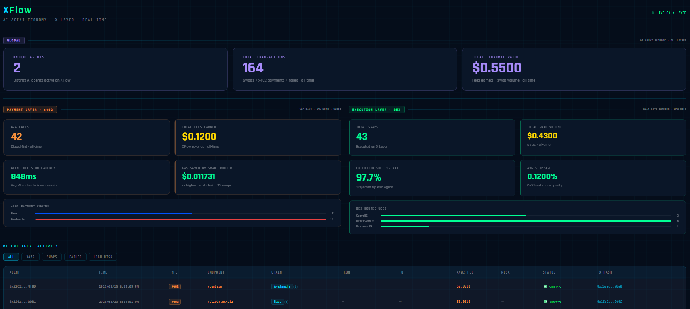
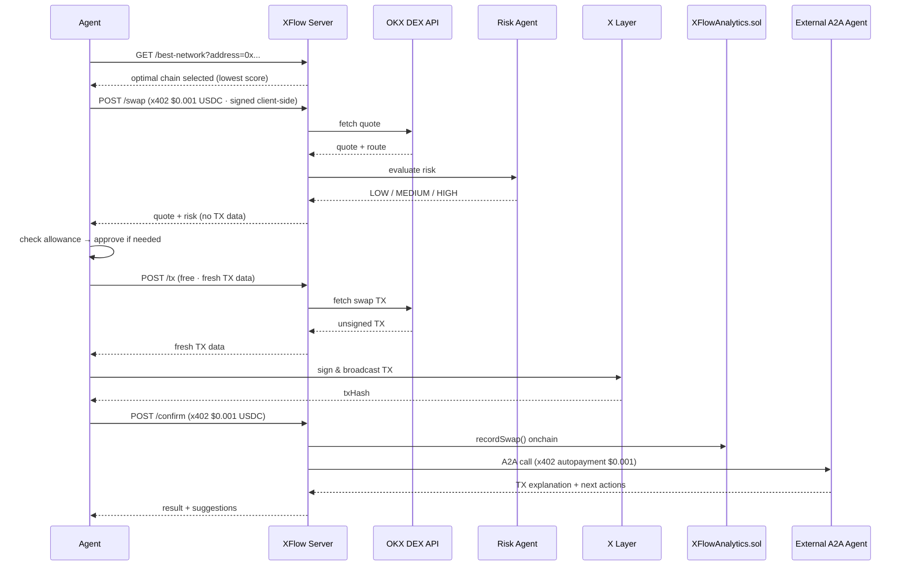

# XFlow — AI Agent Payment Infrastructure on X Layer

> **The missing payment layer for autonomous AI agents.**

XFlow is to AI agents what Stripe is to web apps.

XFlow is built for developers building autonomous AI agents that need to transact onchain. It's a production-deployed multi-agent system where AI agents execute DeFi swaps on X Layer, pay for services using x402 micropayments ($0.001 USDC/call), and autonomously pay other AI agents — all without human intervention after initial setup. Every payment, swap, and agent-to-agent call is recorded onchain.

**[🎬 Demo Video](https://x.com/xflow_lab/status/2036330252180279791)** · **[📦 GitHub](https://github.com/cryptohakka/xflow)**

---

## The Problem

Today's AI agents can reason, plan, and act — but they can't pay. Every API they call requires a human to set up an API key, subscribe to a plan, and manage billing. This is a fundamental bottleneck for autonomous agent systems.

**The result:** Agents that need a human babysitter for every dollar they spend.

| | Before XFlow | After XFlow |
|---|---|---|
| API access | ❌ API keys + subscriptions | ✅ Pay-per-call via x402 |
| Billing | ❌ Manual, human-managed | ✅ Autonomous, onchain |
| Agent→Agent payments | ❌ Not possible | ✅ Native A2A + x402 |
| Chain selection | ❌ Hardcoded | ✅ Auto-optimized by SmartPaymentRouter |
| Audit trail | ❌ Off-chain logs | ✅ Everything onchain |

---

## Why Now

Three forces are converging:

- **AI agents are proliferating** — AutoGPT, LangChain, agent frameworks are mainstream. The next bottleneck isn't intelligence, it's autonomy over money.
- **API economy is hitting limits** — Subscription models and API keys don't scale for agent-to-agent workflows. Agents need machine-native payment primitives.
- **Crypto micropayments are mature** — x402, ERC-4337, stablecoins on L2s make sub-cent payments practical for the first time. The infrastructure is ready.

XFlow is the first system to combine all three into a working production deployment.

---

## What XFlow Does

XFlow is the payment and execution layer for AI agents operating in DeFi. An agent sends a natural language swap request, pays $0.001 USDC automatically from whichever chain scores best, and gets back an executed trade on X Layer — with post-swap analysis from a second AI agent that also gets paid automatically.

```
Agent says:  "swap 0.01 USDC to USDT0"
             ↓
XFlow:       Selects optimal payment chain in 796ms
             Pays $0.001 USDC via x402
             Quotes + risk checks the swap
             Executes on X Layer via OKX DEX Aggregator
             Pays external AI agent $0.001 for TX analysis
             Returns result + next action suggestions
             Records everything onchain
```

No API keys. No subscriptions. No humans in the loop (after initial setup).

---

## Why X Layer

X Layer is the execution chain for all swaps in XFlow for three reasons:

- **Low latency** — ~1s finality, fast enough for autonomous agent workflows
- **Cheap gas** — OKB gas costs are a fraction of Ethereum mainnet
- **OKX DEX Aggregator** — native integration with the best swap routes on X Layer, including CurveNG, Uniswap V2/V3, and OKX StableSwap

But XFlow's value goes beyond a single chain. The full stack looks like this:

| Layer | What XFlow provides |
|-------|---------------------|
| **Chain Abstraction** | Agents pay from any chain — Base, Polygon, Avalanche, X Layer — with no manual chain switching. SmartPaymentRouter handles it automatically. |
| **DEX Execution** | Best-route swaps on X Layer via OKX DEX Aggregator. |
| **Risk Management** | Every swap is evaluated for price impact and route quality before execution. Risky swaps are rejected automatically. |
| **Analytics** | All swaps, payments, and A2A calls recorded onchain. Fully verifiable. |
| **A2A Integration** | Any A2A-compatible agent can be plugged in for post-execution analysis or action. |

Other chains are supported for x402 payments but X Layer is where trades execute.

---

## Business Model

XFlow charges per API call via x402 micropayments:

| Endpoint | Fee | When |
|----------|-----|------|
| `POST /swap` | $0.001 USDC | Per quote + risk assessment |
| `POST /confirm` | $0.001 USDC | Per confirmed swap |

Fees are collected directly to `PAYEE_ADDRESS` with no intermediary. Future pricing includes volume discounts for high-frequency agents and a SaaS tier for teams running multiple agents.

---

## Live Dashboard



*All data verifiable onchain via [XFlowAnalytics.sol](https://www.okx.com/web3/explorer/xlayer/address/0xfb7f08ea7e59974a8b3a80898462dd7826e4b93b)*

---

## The Core Innovation: Three Layers Working Together

### 1. x402 — HTTP-Native Micropayments

x402 turns API access into a pay-per-use primitive. When an agent calls `POST /swap`, the server returns HTTP 402 with payment requirements. The agent's wallet signs a USDC transfer, and the request proceeds automatically — no API keys, no OAuth, no billing portal.

```
Agent → POST /swap
Server ← 402 Payment Required (USDC · any of 4 chains)
Agent → POST /swap + x402 payment header
Server ← 200 OK + swap result
```

XFlow accepts x402 payments on **4 chains simultaneously**: X Layer, Base, Polygon, Avalanche.

### 2. SmartPaymentRouter — Optimal Chain Selection

Paying on the wrong chain wastes money and time. SmartPaymentRouter scans USDC balances across all supported chains and selects the optimal one using a composite score:

```
score = gasCost + finality × $0.0001/s
```

Lower score = better route. An agent with USDC on Avalanche pays ~$0.000025 in gas vs ~$0.001315 on Base — a **52x difference**. SmartPaymentRouter makes this decision automatically, every time.

```
⛽ Estimating gas costs...
   Polygon:   $0.001168 gas · 5s finality   → score $0.001668
   Base:      $0.001315 gas · 2s finality   → score $0.001515
   X Layer:   $0.000089 gas · 1s finality   → score $0.000189
   Avalanche: $0.000025 gas · 0.8s finality → score $0.000105  ✓ selected
```

Routing logic lives **server-side** — the client calls `GET /best-network` to get the optimal chain, then handles signing locally. Private keys never leave the client.

**This also benefits the x402 facilitator.** The facilitator is a third-party service that settles x402 payments onchain on behalf of agents — absorbing the gas cost of every settlement. By routing payments to the cheapest chain, SmartPaymentRouter reduces the facilitator's gas burden across the entire ecosystem:

```
Without SmartRouting (highest-cost chain):
  10,000 payments/day × $0.001235 avg = $12.35/day facilitator cost

With SmartRouting (lowest-cost chain selected):
  10,000 payments/day × $0.000025 avg = $0.25/day facilitator cost

  → 98% cost reduction for the facilitator
  → Based on gas costs observed across supported chains during development
```

SmartPaymentRouter is a systemic improvement — not just a per-agent optimization.

### 3. Agent-to-Agent (A2A) — Agents Paying Agents

After each confirmed swap, XFlow autonomously calls an external AI agent via the A2A protocol (JSON-RPC 2.0 / ERC-8004), pays it $0.001 USDC using x402, receives a TX explanation and next-action suggestions, and passes them back to the caller.

In this deployment, **ClawdMint** is used as the external agent for post-swap analysis. ClawdMint is one example — any A2A-compatible agent can be integrated in its place.

This is the complete agentic payment loop: **human → agent → agent → agent**, with every hop paid automatically and recorded onchain (after initial setup).

```
User Agent
    │  x402 $0.001 (Avalanche)
    ▼
XFlow Orchestrator
    │  parallel dispatch
    ├──▶ DEX Agent (OKX Aggregator)
    ├──▶ Risk Agent (slippage guard)
    └──▶ Analytics Agent (onchain record)
    │
    │  agent0-sdk + x402 $0.001 (Base)
    ▼
External A2A Agent (ClawdMint in this deployment)
```

---

## Architecture

```
External Agent / User
        │
        │  GET /best-network → optimal chain selected server-side
        │  x402 payment ($0.001 USDC · signed client-side)
        ▼
┌─────────────────────────┐
│   Smart Payment Router  │  ← score = gasCost + finality × $0.0001/s
│   x402 Payment Adapter  │  ← handles 402 handshake transparently
└────────────┬────────────┘
             │
             ▼
┌─────────────────────────┐
│      Orchestrator       │  ← LLM intent parsing (Gemini 2.5 Flash Lite)
└────────────┬────────────┘
             │
     ┌───────┴───────┐
     ▼               ▼
┌─────────┐   ┌─────────────┐
│  Risk   │   │  DEX Agent  │  ← OKX DEX Aggregator API
│  Agent  │   │             │  ← unsigned swap TX on X Layer
└────┬────┘   └──────┬──────┘
     └───────┬───────┘
             ▼
    Agent signs & broadcasts on X Layer
             │
             ▼  POST /confirm
     ┌───────┴────────────────┐
     ▼                        ▼
┌──────────────────┐  ┌──────────────────────┐
│ Analytics Agent  │  │  External A2A Agent  │  ← x402 autopayment
│ XFlowAnalytics   │  │  TX explanation      │  ← next action suggestions
│ .sol (X Layer)   │  └──────────────────────┘
└──────────────────┘
```

---

## Sequence Diagram

**Quick overview:**
```
Agent → GET /best-network → optimal chain
Agent → POST /swap (x402 $0.001) → quote + risk
Agent → POST /tx → fresh TX data
Agent → broadcast on X Layer → txHash
Agent → POST /confirm (x402 $0.001) → analytics + A2A analysis
```

**Full sequence:**



---

## Source Structure

```
src/
├── server.ts               # Express server — /best-network, /swap, /tx, /confirm, /dashboard
├── smartPaymentRouter.ts   # Chain selection: score = gasCost + finality × $0.0001/s
├── orchestrator.ts         # LLM intent parsing (Gemini 2.5 Flash Lite)
├── riskAgent.ts            # Risk evaluation — price impact + route quality
├── dexAgent.ts             # OKX DEX Aggregator — quote + TX data
├── tokenResolver.ts        # Token address resolution
├── analyticsAgent.ts       # Onchain swap + x402 + A2A recording
├── clawdmintA2A.ts         # A2A + x402 call to external agent (agent0-sdk)
├── contracts/
│   └── XFlowAnalytics.sol  # Analytics contract (deployed · X Layer)
└── public/
    └── dashboard.html      # Real-time dashboard

client-agent/
├── src/
│   └── index.ts            # Autonomous swap agent — full pipeline
├── Dockerfile
├── docker-compose.yml
└── .env.example
```

---

## Quick Start

### Prerequisites

Before you start, make sure you have:

| Requirement | Purpose | How to get |
|-------------|---------|------------|
| `PRIVATE_KEY` (XFlow wallet) | Analytics TXs + A2A payments | Any EVM wallet |
| OKX API key | OKX DEX Aggregator | [OKX Web3 Developer Portal](https://web3.okx.com) |
| OpenRouter API key | LLM intent parsing (Gemini 2.5 Flash Lite) | [openrouter.ai](https://openrouter.ai) |
| PayAI API key | x402 facilitator | [merchant.payai.network](https://merchant.payai.network) |
| OKB on X Layer | Gas for swap TXs (XFlow server wallet) | OKX Exchange → withdraw to X Layer |
| `PRIVATE_KEY` (client wallet) | x402 payments + swap broadcasting | Any EVM wallet |
| USDC on Avalanche/Base/Polygon/X Layer | x402 payment source | Any DEX or CEX |
| OKB on X Layer | Gas for swap TXs (client wallet) | OKX Exchange → withdraw to X Layer |

---

### Step 1 — Run XFlow Server

```bash
git clone https://github.com/cryptohakka/xflow
cd xflow
cp .env.example .env
# Edit .env — fill in all required values
docker compose up -d
```

Dashboard: `http://localhost:3010`

> **Security:** Use a dedicated wallet with minimal funds. Never commit `.env` to version control.

`.env.example`:
```bash
PRIVATE_KEY=0x...            # XFlow server wallet (needs OKB on X Layer)
OKX_API_KEY=                 # OKX Web3 Developer Portal
OKX_SECRET_KEY=
OKX_PASSPHRASE=
OPENROUTER_API_KEY=          # OpenRouter (Gemini 2.5 Flash Lite)
ANALYTICS_CONTRACT=0xfb7f08ea7e59974a8b3a80898462dd7826e4b93b
PAYEE_ADDRESS=0x...          # x402 payment recipient (your revenue wallet)
PAYAI_API_KEY_ID=            # PayAI merchant portal
PAYAI_API_KEY_SECRET=
PORT=3010
```

---

### Step 2 — Run Client Agent

The included client agent autonomously sends swap requests to XFlow using x402 micropayments.

```bash
cd client-agent
cp .env.example .env
# Edit .env — fill in your wallet and swap query
docker compose up
```

`client-agent/.env.example`:
```bash
PRIVATE_KEY=0x...                    # Your wallet (needs USDC on supported chain + OKB on X Layer)
XFLOW_URL=http://localhost:3010      # XFlow server URL
SWAP_QUERY=swap 0.01 USDC to USDT0  # Natural language swap instruction
```

That's it. The agent will:
1. Ask XFlow to select the optimal payment chain (`GET /best-network`)
2. Pay $0.001 USDC to XFlow via x402 (signed locally — private key never leaves client)
3. Receive a quote + risk assessment
4. Sign and broadcast the swap TX on X Layer
5. Pay $0.001 USDC to confirm the swap
6. Receive TX analysis from the external A2A agent (agent pays agent automatically)

Watch the dashboard at `http://localhost:3010` to see everything recorded onchain in real time.

---

### Step 3 — Use Your Own Agent

XFlow is a standard HTTP API with x402 payment protection. Any x402-compatible agent can call it directly.

```typescript
import { wrapFetchWithPaymentFromConfig } from '@x402/fetch';
import { ExactEvmScheme } from '@x402/evm';
import { privateKeyToAccount } from 'viem/accounts';

const account = privateKeyToAccount(PRIVATE_KEY);

// Ask XFlow server for the optimal payment chain
// (routing logic is server-side; private key stays local)
const { selectedNetwork, allBalances } = await fetch(
  `http://localhost:3010/best-network?address=${account.address}`
).then(r => r.json());

// x402 signing stays client-side
const fetchWithPayment = wrapFetchWithPaymentFromConfig(fetch, {
  schemes: [{ network: selectedNetwork.network, client: new ExactEvmScheme(account) }],
});

// POST /swap — pays $0.001 USDC automatically, returns quote + risk
const swapRes = await fetchWithPayment('http://localhost:3010/swap', {
  method: 'POST',
  headers: { 'Content-Type': 'application/json' },
  body: JSON.stringify({
    query: 'swap 0.01 USDC to USDT0',
    userAddress: account.address,
  }),
});
```

See [API Reference](#api-reference) for the full integration guide.

---

## API Reference

### `GET /best-network` — free

Returns the optimal chain for x402 payment based on USDC balances, gas cost, and finality time. Called by client-agent before `/swap`. Routing logic runs server-side; private keys never leave the client.

```
GET /best-network?address=0x...
```

```json
// Response
{
  "selectedNetwork": {
    "network": "eip155:43114",
    "name": "Avalanche",
    "balanceFormatted": "0.094",
    "gasCostUSD": 0.000025,
    "finalitySeconds": 0.8,
    "score": 0.000105
  },
  "allBalances": [
    { "name": "Base",      "balanceFormatted": "0.144", "sufficient": true,  "gasCostUSD": 0.001235, "score": 0.001435 },
    { "name": "Polygon",   "balanceFormatted": "0.200", "sufficient": true,  "gasCostUSD": 0.001222, "score": 0.001722 },
    { "name": "Avalanche", "balanceFormatted": "0.094", "sufficient": true,  "gasCostUSD": 0.000025, "score": 0.000105 },
    { "name": "X Layer",   "balanceFormatted": "0.120", "sufficient": true,  "gasCostUSD": 0.000200, "score": 0.000300 }
  ]
}
```

### `POST /swap` — x402 protected · $0.001 USDC

Returns quote and risk assessment. Does **not** include TX data — call `/tx` right before broadcast.

```json
// Request
{ "query": "swap 0.01 USDC to USDT0", "userAddress": "0x..." }

// Response
{
  "success": true,
  "decisionMs": 796,
  "result": {
    "intent": { "action": "swap", "fromToken": "USDC", "toToken": "USDT0", "amount": "0.01" },
    "data": {
      "risk": { "riskLevel": "LOW", "approved": true },
      "quote": {
        "fromToken": "USDC", "toToken": "USDT0",
        "fromAmount": "0.01", "toAmount": "0.010016",
        "route": "OkxStableSwap", "priceImpact": "0.00%"
      }
    }
  }
}
```

### `POST /tx` — free · call immediately before broadcast

Fetches fresh TX data. Call **after** approve, **immediately** before broadcast.

```json
// Request
{
  "query": "swap 0.01 USDC to USDT0",
  "userAddress": "0x...",
  "fromTokenAddress": "0x74b7...",
  "toTokenAddress": "0x1e4a..."
}

// Response
{
  "success": true,
  "result": { "data": { "result": {
    "tx": { "to": "0xD1b8...", "data": "0x...", "gas": "930231", "gasPrice": "20000001", "chainId": 196 }
  }}}
}
```

### `POST /confirm` — x402 protected · $0.001 USDC

Records swap onchain and triggers external A2A agent analysis.

```json
// Request
{
  "txHash": "0x...", "fromToken": "USDC", "toToken": "USDT0",
  "fromAmount": "0.01", "toAmount": "0.010016",
  "paymentNetwork": "eip155:43114", "route": "OkxStableSwap",
  "riskLevel": "LOW", "agentAddress": "0x..."
}

// Response
{
  "success": true,
  "analyticsTx": "0x...",
  "clawdmint": {
    "txExplanation": "Swapped 0.01 USDC for 0.010016 USDT0 via OkxStableSwap on X Layer...",
    "nextActions": "Deploy USDT0 to USDT0/WOKB pool on Uniswap X Layer",
    "paidWithX402": true,
    "note": "Powered by ClawdMint via A2A + x402"
  }
}
```

### `GET /dashboard` — free

Real-time analytics from XFlowAnalytics.sol. Includes `avgDecisionMs` (session memory) and `totalGasSavedUSD` (persisted to `gas_saved.json` across restarts).

### `GET /health` — free

```json
{ "status": "ok", "service": "XFlow", "version": "0.1.0" }
```

---

## Risk Agent Logic

Every swap is evaluated before execution. Source: [`src/riskAgent.ts`](./src/riskAgent.ts)

| Factor | Score 0 | Score 1 | Score 2 | Score 3 | Score 4 |
|--------|---------|---------|---------|---------|---------|
| Price impact | ≤ 0% | < 0.1% | 0.1–0.5% | 0.5–2% | > 2% |
| Route quality | Known DEX | — | Unknown route | — | — |

```
finalScore = max(priceImpactScore, routeScore)

≥ 4  → HIGH    → rejected + recorded onchain
≥ 2  → MEDIUM  → approved with warning
< 2  → LOW     → approved
```

HIGH and UNKNOWN swaps are rejected before TX generation. All rejections recorded via `recordFailedSwap()`.

---

## Gas Model

XFlow has two distinct gas surfaces:

| Step | Gas required | Paid by | Chain |
|------|-------------|---------|-------|
| `POST /swap` API call | No | x402 facilitator (USDC) | Any supported chain |
| `POST /confirm` API call | No | x402 facilitator (USDC) | Any supported chain |
| Swap TX broadcast | **Yes (OKB)** | Calling agent | X Layer |
| Analytics record | Yes (OKB) | XFlow server wallet | X Layer |
| A2A agent call | No | x402 facilitator (USDC) | Base |

**Summary:** Calling XFlow costs only USDC — no gas token needed for API calls. The actual swap execution on X Layer requires a small amount of OKB.

---

## Supported Payment Networks (x402)

| Chain | Network ID | USDC Address | Finality |
|-------|-----------|------|----------|
| X Layer | `eip155:196` | `0x74b7f16337b8972027f6196a17a631ac6de26d22` | ~1s |
| Base | `eip155:8453` | `0x833589fCD6eDb6E08f4c7C32D4f71b54bdA02913` | ~2s |
| Polygon | `eip155:137` | `0x3c499c542cEF5E3811e1192ce70d8cC03d5c3359` | ~5s |
| Avalanche | `eip155:43114` | `0xB97EF9Ef8734C71904D8002F8b6Bc66Dd9c48a6E` | ~0.8s |

---

## Onchain Contracts (X Layer)

| Contract | Address | Explorer |
|----------|---------|---------|
| XFlowAnalytics | `0xfb7f08ea7e59974a8b3a80898462dd7826e4b93b` | [View on OKX Explorer](https://www.okx.com/web3/explorer/xlayer/address/0xfb7f08ea7e59974a8b3a80898462dd7826e4b93b) |

---

## Environment Variables

```bash
PRIVATE_KEY=0x...            # Wallet for analytics TXs + A2A payments
OKX_API_KEY=                 # OKX Web3 Developer Portal
OKX_SECRET_KEY=
OKX_PASSPHRASE=
OPENROUTER_API_KEY=          # Gemini 2.5 Flash Lite via OpenRouter
ANALYTICS_CONTRACT=0xfb7f08ea7e59974a8b3a80898462dd7826e4b93b
PAYEE_ADDRESS=0x...          # x402 payment recipient (XFlow revenue)
PAYAI_API_KEY_ID=            # PayAI merchant portal (https://merchant.payai.network)
PAYAI_API_KEY_SECRET=
PORT=3010
```

---

## Known Limitations

- **External dependencies** — OKX DEX Aggregator, OpenRouter, payai facilitator, and the external A2A agent must all be reachable. `/health` reflects server status only.
- **No testnet** — X Layer has no public testnet. All testing is on mainnet with small amounts.
- **Session-only latency metric** — `avgDecisionMs` resets on server restart. `totalGasSavedUSD` is persisted to `gas_saved.json` and survives restarts. Onchain metrics (`totalSwaps`, `totalVolume` etc.) are always persistent.
- **Static finality values** — SmartPaymentRouter uses hardcoded finality estimates. Real-time tracking is a roadmap item.
- **Facilitator proxy** — In Docker environments with restricted outbound HTTPS, a local proxy on port 3011 is required for x402 settlement.

---

## Roadmap

- [ ] Real-time finality tracking per chain
- [ ] Additional chains (Abstract, SKALE)
- [ ] Volume-based pricing (high-frequency agent discounts)
- [ ] Multi-chain split payments
- [ ] `npm install @xflow/payment-router` SDK package
- [ ] Persistent decision latency metric (onchain)

---

## Built With

| Component | Role |
|-----------|------|
| [x402 Protocol](https://x402.org) | HTTP-native micropayments |
| [OKX DEX Aggregator](https://web3.okx.com) | Best swap routes on X Layer |
| [OKX OnchainOS](https://web3.okx.com/onchain-os) | Onchain OS Skills |
| [X Layer](https://www.okx.com/xlayer) | EVM execution chain (eip155:196) |
| [ClawdMint](https://clawdmint.com) | External A2A agent (post-swap analysis) |
| [agent0 SDK](https://www.ag0.xyz/) | A2A protocol + x402 payments (ERC-8004) |
| [payai facilitator](https://facilitator.payai.network) | x402 settlement layer |
| [OpenRouter](https://openrouter.ai/) | LLM gateway (Gemini 2.5 Flash Lite) |
| [viem](https://viem.sh) | EVM interactions |

---

## License

MIT

---

> *XFlow was built for the OKX x402 Hackathon. All swaps executed on X Layer mainnet. All payments settled onchain.*
