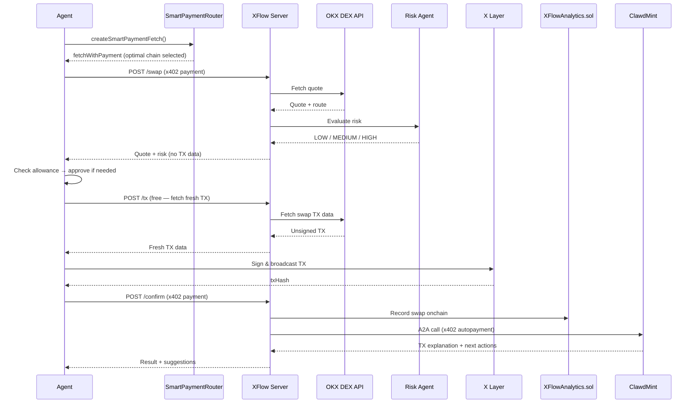

# XFlow

**AI Agent Payment Infrastructure on X Layer**

XFlow is a multi-agent system that enables AI agents to autonomously execute DeFi operations using x402 micropayments. Any agent holding USDC on any supported chain can pay and access XFlow's swap pipeline — no API keys, no subscriptions, pay only what you use.

> **Disclaimer:** This software is provided for experimental and educational purposes only. It is not financial advice. Use at your own risk. DeFi transactions are irreversible — always verify parameters before signing.

---

## Table of Contents

- [Architecture](#architecture)
- [Sequence Diagram](#sequence-diagram)
- [Source Structure](#source-structure)
- [Key Features](#key-features)
- [Why XFlow](#why-xflow)
- [Agent-to-Agent (A2A) + x402](#agent-to-agent-a2a--x402)
- [How XFlow Compares](#how-xflow-compares)
- [Supported Payment Networks](#supported-payment-networks-x402)
- [Onchain Contracts](#onchain-contracts-x-layer)
- [Quick Start](#quick-start)
- [API Reference](#api-reference)
- [Pipeline Flow](#pipeline-flow)
- [Risk Agent Logic](#risk-agent-logic)
- [Gas Model](#gas-model)
- [Known Limitations](#known-limitations)
- [Environment Variables](#environment-variables)
- [Roadmap](#roadmap)
- [Built With](#built-with)

---

## Architecture

```
External Agent / User
        │
        │  x402 payment (any chain: Base / Polygon / Avalanche / X Layer)
        ▼
┌─────────────────────────┐
│   Smart Payment Router  │  ← Scores chains by: gasCost + finality × $0.0001/s
│   x402 Payment Adapter  │  ← Handles 402 handshake automatically
└────────────┬────────────┘
             │
             ▼
┌─────────────────────────┐
│      Orchestrator       │  ← LLM-powered intent parsing (Gemini 2.5 Flash Lite)
└────────────┬────────────┘
             │
     ┌───────┴───────┐
     ▼               ▼
┌─────────┐   ┌─────────────┐
│  Risk   │   │  DEX Agent  │  ← OKX DEX Aggregator API
│  Agent  │   │             │  ← Generates unsigned swap TX on X Layer
└────┬────┘   └──────┬──────┘
     │               │
     └───────┬───────┘
             │
             ▼ (unsigned TX returned to Agent via POST /tx)
             │
    Agent signs & broadcasts on X Layer
    (requires OKB for gas)
             │
             ▼ (POST /confirm with swap txHash)
     ┌───────┴───────────────┐
     ▼                       ▼
┌─────────────────┐   ┌──────────────────────┐
│ Analytics Agent │   │  ClawdMint A2A Agent │  ← A2A + x402 auto-payment
│ (onchain record)│   │  TX explanation      │  ← Next action suggestions
└────────┬────────┘   └──────────────────────┘
         │
         ▼
┌─────────────────────────┐
│      Dashboard          │  ← Real-time visualization
│  (XFlowAnalytics.sol)   │  ← Deployed on X Layer
│  TX hash explorer links │
│  Cumulative volume      │
└─────────────────────────┘
```

---

## Sequence Diagram



---

## Source Structure

```
src/
├── server.ts                # Express server — /swap, /tx, /confirm, /dashboard
├── smartPaymentRouter.ts    # Chain selection: gasCost + finality × $0.0001/s
├── orchestrator.ts          # LLM intent parsing (Gemini 2.5 Flash Lite)
├── riskAgent.ts             # Risk evaluation — price impact + route quality
├── dexAgent.ts              # OKX DEX Aggregator — quote + TX data
├── tokenResolver.ts         # Token address resolution (OKX API + known list)
├── analyticsAgent.ts        # Onchain swap recording
├── clawdmintA2A.ts          # A2A + x402 call to ClawdMint
├── contracts/
│   └── XFlowAnalytics.sol   # Analytics smart contract (deployed on X Layer)
└── public/
    └── index.html           # Real-time dashboard
```

---

## Key Features

- **Smart Payment Router** — Checks USDC balances across all supported chains and automatically selects the optimal chain using a composite score: `gasCost + finality × $0.0001/s`. A chain with cheap gas but slow finality may lose to one that's slightly more expensive but settles faster. Handles the x402 402-handshake transparently — any x402-compatible agent can call XFlow without worrying about which chain to pay from.
- **LLM Intent Parsing** — Natural language → structured swap parameters via Gemini 2.5 Flash Lite (OpenRouter).
- **Risk Agent** — Evaluates price impact and route quality before execution. Rejects HIGH risk swaps automatically. See [Risk Agent Logic](#risk-agent-logic).
- **DEX Agent** — Fetches unsigned swap TX data via OKX OnchainOS DEX Aggregator API on X Layer.
- **Analytics Agent** — Records all swap activity onchain via `XFlowAnalytics.sol` on X Layer — successful swaps and Risk Agent rejections both captured.
- **ClawdMint A2A** — After each confirmed swap, XFlow autonomously calls ClawdMint via Agent-to-Agent (A2A) protocol with x402 micropayment. Returns TX explanation and next action suggestions.
- **Real-time Dashboard** — Visualizes agent activity, payment chains, DEX routes, cumulative volume, and TX hash explorer links.

---

## Why XFlow?

> x402 kills subscriptions. Pay only when you use it.

Traditional APIs require API keys, subscriptions, and manual billing. XFlow uses x402 — HTTP-native micropayments where AI agents pay $0.001 per call in USDC, automatically, from whichever chain scores best at that moment.

**For AI Agents:**
- No API keys needed
- No subscriptions
- Pay from any chain — SmartPaymentRouter handles the rest
- Full onchain audit trail of every swap
- Post-swap AI analysis via ClawdMint A2A (agent pays agent, automatically)

**For the Agent Economy:**
SmartPaymentRouter doesn't just optimize for the caller — it reduces gas costs for the x402 facilitator too. The facilitator settles payments onchain on behalf of agents; by routing payments to the cheapest chain, the total gas burden across all settlements decreases. Lower facilitator costs mean more sustainable infrastructure for the agent economy as a whole.

---

## Agent-to-Agent (A2A) + x402

XFlow demonstrates the full agentic payment stack: not just human→agent payments, but **agent→agent payments**.

After a successful swap, XFlow automatically:
1. Calls ClawdMint's A2A endpoint
2. Pays for the analysis using x402 (USDC micropayment, no human involved)
3. Returns TX explanation and suggested next actions to the caller

This is the core loop of the AI agent economy — agents autonomously paying other agents for services, settled onchain, with no human in the loop.

---

## How XFlow Compares

| | Traditional API | Bridge + DEX | XFlow |
|--|--|--|--|
| **Payment** | Credit card / subscription | Manual onchain TX | x402 micropayment ($0.001) |
| **Chain flexibility** | Single chain | Bridge required (5-30 min) | Any chain, instant |
| **API call gas** | No | Yes | No (x402 via facilitator) |
| **Swap execution gas** | No | Yes | Yes (OKB on X Layer) |
| **For AI Agents** | API keys needed | Complex multi-step | Single HTTP request |
| **Automation** | Possible | Difficult | Native |
| **Cost** | Fixed monthly | Bridge fee + gas | Pay per use |
| **Audit trail** | Centralized logs | Onchain | Onchain (X Layer) |
| **Agent→Agent** | Not supported | Not supported | Native (A2A + x402) |

### The Key Insight

> Before XFlow: To use a service on X Layer, you needed X Layer USDC + X Layer gas.
>
> With XFlow: You need USDC on **any** supported chain. XFlow's Smart Payment Router finds the optimal chain automatically — no bridging, no gas tokens needed for the API call itself.

**Example:**
```
Without XFlow:
1. Check which chain the service accepts
2. Bridge USDC to that chain (wait 5-30 min, pay bridge fee)
3. Get gas token for that chain
4. Finally call the service

With XFlow:
1. Call the service → Smart Payment Router handles the x402 payment
2. Sign & broadcast the returned swap TX on X Layer (requires OKB for gas)
```

---

## Supported Payment Networks (x402)

| Chain | Network ID | USDC Address | Finality |
|-------|-----------|------|----------|
| X Layer | `eip155:196` | `0x74b7f16337b8972027f6196a17a631ac6de26d22` | ~1s |
| Base | `eip155:8453` | `0x833589fCD6eDb6E08f4c7C32D4f71b54bdA02913` | ~2s |
| Polygon | `eip155:137` | `0x3c499c542cEF5E3811e1192ce70d8cC03d5c3359` | ~5s |
| Avalanche | `eip155:43114` | `0xB97EF9Ef8734C71904D8002F8b6Bc66Dd9c48a6E` | ~0.8s |

---

## Onchain Contracts (X Layer)

| Contract | Address | Explorer |
|----------|---------|---------|
| XFlowAnalytics | `0xf88A47a15fAa310E11c67568ef934141880d473e` | [View](https://www.okx.com/web3/explorer/xlayer/address/0xf88A47a15fAa310E11c67568ef934141880d473e) |

---

## Quick Start

### 1. Run XFlow Server

```bash
git clone https://github.com/cryptohakka/xflow
cd xflow
cp .env.example .env
# Fill in PRIVATE_KEY, OKX_API_KEY, OKX_SECRET_KEY, OKX_PASSPHRASE, OPENROUTER_API_KEY
docker compose up -d
```

> **Security note:** Never commit `.env` to version control. Use a dedicated wallet with only the funds needed for operation. For production deployments, consider a secrets manager (AWS Secrets Manager, HashiCorp Vault, etc.) instead of plaintext env files.

### 2. Call XFlow as an Agent (Smart Payment Router)

```typescript
import { createSmartPaymentFetch } from './src/smartPaymentRouter.js';
import { createWalletClient, http } from 'viem';
import { privateKeyToAccount } from 'viem/accounts';

// Step 1: SmartPaymentRouter — auto-selects optimal chain
// Scoring: gasCost + finality × $0.0001/s
const { fetchWithPayment, selectedNetwork } = await createSmartPaymentFetch(PRIVATE_KEY);

// Step 2: POST /swap — x402 payment + quote + risk assessment
// Returns quote and risk evaluation. Does NOT include TX data yet.
const swapRes = await fetchWithPayment('http://localhost:3010/swap', {
  method: 'POST',
  headers: { 'Content-Type': 'application/json' },
  body: JSON.stringify({
    query: 'swap 1 USDC to OKB',
    userAddress: '0x...',
  }),
});
const quoteData = await swapRes.json();
const quote = quoteData.result.data.quote;
// → approve/check allowance here if needed

// Step 3: POST /tx — fetch fresh TX data right before broadcast
// Called after approve to avoid quote expiry (execution revert)
const txRes = await fetch('http://localhost:3010/tx', {
  method: 'POST',
  headers: { 'Content-Type': 'application/json' },
  body: JSON.stringify({
    query: 'swap 1 USDC to OKB',
    userAddress: '0x...',
    fromTokenAddress: quote.fromTokenAddress,
    toTokenAddress: quote.toTokenAddress,
  }),
});
const txData = await txRes.json();
const tx = txData.result.data.result.tx;

// Step 4: Agent signs & broadcasts the unsigned TX
// Note: requires OKB on X Layer for gas
const walletClient = createWalletClient({ ... });
const swapHash = await walletClient.sendTransaction({
  to: tx.to, data: tx.data,
  gas: BigInt(Math.floor(Number(tx.gas) * 1.5)),
  gasPrice: BigInt(tx.gasPrice),
  chainId: 196,
});

// Step 5: POST /confirm — triggers Analytics + ClawdMint A2A
const confirmRes = await fetchWithPayment('http://localhost:3010/confirm', {
  method: 'POST',
  headers: { 'Content-Type': 'application/json' },
  body: JSON.stringify({
    txHash: swapHash,
    fromToken: quote.fromToken,
    toToken: quote.toToken,
    fromAmount: quote.fromAmount,
    toAmount: quote.toAmount,
    paymentNetwork: selectedNetwork.network,
    route: quote.route,
    riskLevel: quoteData.result.data.risk.riskLevel,
    agentAddress: '0x...',
  }),
});
const result = await confirmRes.json();
// result.clawdmint.txExplanation  — AI explanation of the swap TX
// result.clawdmint.nextActions    — suggested follow-up actions
```

### 3. Manual x402 Payment (specific chain)

```typescript
import { wrapFetchWithPaymentFromConfig } from '@x402/fetch';
import { ExactEvmScheme } from '@x402/evm';
import { privateKeyToAccount } from 'viem/accounts';

const account = privateKeyToAccount(PRIVATE_KEY);
const fetchWithPayment = wrapFetchWithPaymentFromConfig(fetch, {
  schemes: [{ network: 'eip155:196', client: new ExactEvmScheme(account) }],
});

const res = await fetchWithPayment('http://localhost:3010/swap', {
  method: 'POST',
  headers: { 'Content-Type': 'application/json' },
  body: JSON.stringify({ query: 'swap 0.01 USDC to OKB', userAddress: '0x...' }),
});
```

---

## API Reference

### `POST /swap` (x402 protected · $0.001 USDC)

Returns quote and risk assessment only. **Does not include TX data** — call `/tx` right before broadcast to get fresh TX data and avoid quote expiry.

Request:
```json
{
  "query": "swap 1 USDC to OKB",
  "userAddress": "0x..."
}
```

Response:
```json
{
  "success": true,
  "result": {
    "intent": { "action": "swap", "fromToken": "USDC", "toToken": "WOKB", "amount": "1" },
    "data": {
      "status": "approved",
      "risk": { "riskLevel": "LOW", "riskScore": 0, "approved": true },
      "quote": {
        "fromToken": "USDC",
        "toToken": "WOKB",
        "fromAmount": "1",
        "toAmount": "0.010417",
        "route": "Uniswap V3",
        "priceImpact": "0.05%",
        "fromTokenAddress": "0x74b7...",
        "toTokenAddress": "0xe538...",
        "spender": "0xD1b8..."
      },
      "txEndpoint": "/tx"
    }
  }
}
```

### `POST /tx` (free · call right before broadcast)

Fetches fresh TX data from OKX DEX Aggregator. Call this **after** allowance/approve is confirmed, immediately before broadcasting — this avoids quote expiry that causes `execution reverted`.

Request:
```json
{
  "query": "swap 1 USDC to OKB",
  "userAddress": "0x...",
  "fromTokenAddress": "0x74b7...",
  "toTokenAddress": "0xe538..."
}
```

Response:
```json
{
  "success": true,
  "result": {
    "data": {
      "result": {
        "tx": {
          "to": "0xD1b8...",
          "data": "0x...",
          "gas": "930231",
          "gasPrice": "20000001",
          "value": "0",
          "chainId": 196
        }
      }
    }
  }
}
```

### `POST /confirm` (x402 protected · $0.001 USDC)

Records the swap onchain and triggers ClawdMint A2A analysis automatically.

Request:
```json
{
  "txHash": "0x...",
  "fromToken": "USDC",
  "toToken": "WOKB",
  "fromAmount": "1.0",
  "toAmount": "0.010417",
  "paymentNetwork": "eip155:43114",
  "route": "Uniswap V3",
  "riskLevel": "LOW",
  "agentAddress": "0x..."
}
```

Response:
```json
{
  "success": true,
  "analyticsTx": "0x...",
  "clawdmint": {
    "txExplanation": "Swapped 1 USDC for 0.010417 WOKB via Uniswap V3 on X Layer...",
    "nextActions": ["Consider the USDT0/WOKB pool on Uniswap X Layer as a yield opportunity"],
    "paidWithX402": true,
    "note": "Powered by ClawdMint via A2A + x402"
  }
}
```

### `GET /dashboard` (free)

Returns real-time analytics from `XFlowAnalytics.sol`, including cumulative volume and TX hashes.

### `GET /health` (free)

```json
{ "status": "ok", "service": "XFlow", "version": "0.1.0" }
```

---

## Pipeline Flow

```
1.  Agent sends natural language swap request + x402 payment ($0.001 USDC)
2.  Smart Payment Router checks USDC balances across 4 chains
3.  Optimal chain selected by score: gasCost + finality × $0.0001/s
4.  x402 payment settled by payai facilitator
5.  Orchestrator parses intent with Gemini 2.5 Flash Lite
6.  Risk Agent evaluates price impact & route quality → approves or rejects
7.  Quote returned to agent (no TX data yet — avoids quote expiry)
8.  Agent checks allowance → approves token spend if needed
9.  Agent calls POST /tx → fresh TX data fetched from OKX DEX Aggregator
10. Agent signs & broadcasts TX on X Layer (OKB gas required)
11. Agent calls POST /confirm with swap txHash
12. Analytics Agent records swap onchain (XFlowAnalytics.sol, X Layer)
13. ClawdMint A2A Agent analyzes TX via A2A + x402 (agent pays agent)
14. Dashboard reflects new swap: TX hash explorer link + cumulative volume update
```

---

## Risk Agent Logic

The Risk Agent evaluates every swap before execution. Source: [`src/riskAgent.ts`](./src/riskAgent.ts)

**Scoring criteria:**

| Factor | Score 0 | Score 1 | Score 2 | Score 3 | Score 4 |
|--------|---------|---------|---------|---------|---------|
| Price impact | negative or 0% | < 0.1% | 0.1–0.5% | 0.5–2% | > 2% |
| Route quality | Known DEX (0) | — | Unknown route (2) | — | — |

**Decision logic:**
```
finalScore = max(priceImpactScore, routeScore)

if priceImpact data unavailable → UNKNOWN  (rejected)
if finalScore >= 4              → HIGH     (rejected)
elif finalScore >= 2            → MEDIUM   (approved with warning)
else                            → LOW      (approved)
```

In practice: swaps with price impact < 2% are approved (MEDIUM or below). Only price impact > 2% triggers HIGH and rejection. Since OKX DEX Aggregator returns only verified DEXes, route score is typically 0.

HIGH risk and UNKNOWN swaps are rejected before TX generation. Rejections are recorded onchain via `recordFailedSwap`.

---

## Gas Model

XFlow has two distinct gas surfaces — it's important to understand both:

| Step | Gas required | Paid by | Chain |
|------|-------------|---------|-------|
| x402 API call (`POST /swap`) | No | Facilitator handles settlement | Any supported chain |
| x402 API call (`POST /confirm`) | No | Facilitator handles settlement | Any supported chain |
| Swap TX broadcast | **Yes** | Agent (caller) | X Layer (OKB) |
| Analytics record | Yes | XFlow server wallet | X Layer (OKB) |
| ClawdMint A2A call | No (x402) | XFlow server wallet (USDC) | Base |

**In short:** Calling the XFlow API costs only USDC (no gas). But executing the actual swap on X Layer requires OKB for gas — the agent must hold a small amount of OKB on X Layer.

---

## Known Limitations

- **External service dependencies** — XFlow relies on OKX DEX Aggregator, OpenRouter (Gemini), payai facilitator, and ClawdMint. If any of these are unavailable, the corresponding step will fail. The `/health` endpoint reflects server status only; downstream service health is not currently monitored.
- **No testnet support** — X Layer does not have a public testnet. All testing is performed on mainnet with small amounts.
- **recentSwaps window** — The dashboard shows the last 10 swaps from the analytics contract. Historical volume beyond this window uses an on-chain `totalVolume()` if available, otherwise falls back to the visible window sum.
- **Facilitator proxy** — In some Docker environments where outbound HTTPS from bridge networks is restricted, a local proxy is required to relay facilitator requests. If you encounter `free_tier_exhausted` errors, ensure your PayAI API credentials are set and credits are available at [merchant.payai.network](https://merchant.payai.network).
- **Single analytics contract** — There is no replay protection at the application layer beyond what the EVM provides. The analytics contract records data but does not gate swap execution.
- **Finality values are static** — The Smart Payment Router uses hardcoded finality values (Avalanche: 0.8s, X Layer: 1s, Base: 2s, Polygon: 5s). Real-time finality tracking is a planned roadmap item.

---

## Environment Variables

```bash
PRIVATE_KEY=0x...           # Wallet for signing analytics + ClawdMint A2A txs
OKX_API_KEY=                # OKX Web3 Developer Portal
OKX_SECRET_KEY=
OKX_PASSPHRASE=
OPENROUTER_API_KEY=         # Gemini 2.5 Flash Lite via OpenRouter
ANALYTICS_CONTRACT=0xf88A47a15fAa310E11c67568ef934141880d473e
PAYEE_ADDRESS=0x...         # x402 payment recipient
PAYAI_API_KEY_ID=            # PayAI merchant portal (https://merchant.payai.network)
PAYAI_API_KEY_SECRET=        # PayAI merchant portal
PORT=3010
```

> **Security note:** Use a dedicated hot wallet with minimal funds. Never reuse a wallet holding significant assets. For production, use a secrets manager rather than `.env` files.

---

## Roadmap

- [ ] Real-time finality tracking per chain (currently static values)
- [ ] More supported payment chains (SKALE Base, Abstract)
- [ ] Volume-based pricing (high-frequency agents get discounts)
- [ ] Multi-chain aggregated payment (split payment across chains)
- [ ] Agent SDK package (`npm install @xflow/payment-router`)

---

## Built With

- [x402 Protocol](https://x402.org) — HTTP-native micropayments
- [OKX DEX Aggregator](https://web3.okx.com) — Best swap routes on X Layer
- [OKX OnchainOS](https://web3.okx.com/onchain-os) — Onchain OS Skills
- [ClawdMint](https://clawdmint.com) — A2A agent with x402 payments
- [payai facilitator](https://facilitator.payai.network) — x402 settlement
- [X Layer](https://www.okx.com/xlayer) — EVM chain by OKX (eip155:196)
- [agent 0](https://www.ag0.xyz/) — Agent identity & x402 payment SDK (ERC-8004)
- [OpenRouter](https://openrouter.ai/) — LLM gateway (Gemini 2.5 Flash Lite)
- [viem](https://viem.sh) — EVM interactions

---

## License

MIT
