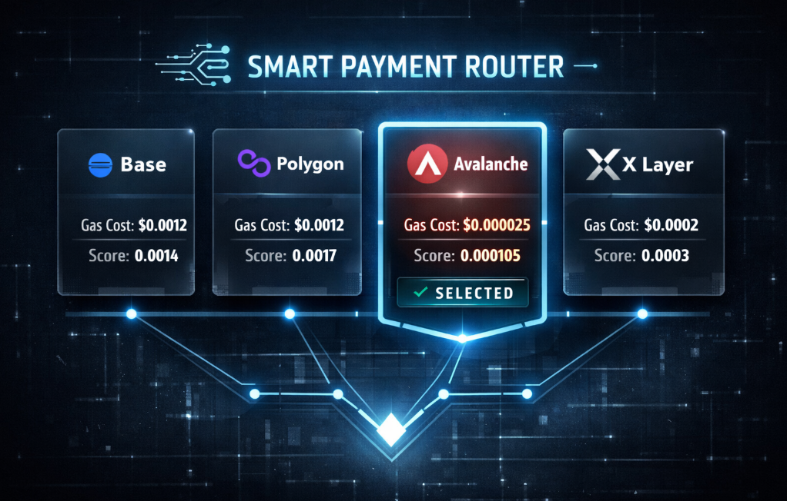
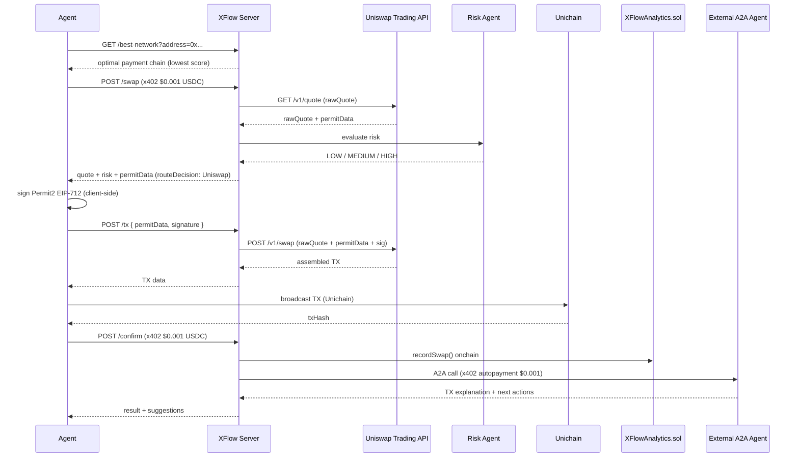

# XFlow — AI Agent Payment Infrastructure on X Layer

> **The missing payment layer for autonomous AI agents.**

XFlow is to AI agents what Stripe is to web apps.

XFlow is built for developers building autonomous AI agents that need to transact onchain. It's a production-deployed multi-agent system where AI agents execute DeFi swaps on X Layer and Unichain, pay for services using x402 micropayments ($0.001 USDC/call), and autonomously pay other AI agents — all without human intervention after initial setup. Every payment, swap, and agent-to-agent call is recorded onchain.

**[🎬 Demo Video](https://x.com/xflow_lab/status/2036330252180279791)** · **[📦 GitHub](https://github.com/cryptohakka/xflow)** · **[📊 Dashboard](https://xflow.a2aflow.space/dashboard.html)**

---

## The Problem

Today's AI agents can reason, plan, and act — but they can't pay. Every API they call requires a human to set up an API key, subscribe to a plan, and manage billing. This is a fundamental bottleneck for autonomous agent systems.

**The result:** Agents that need a human babysitter for every dollar they spend.

| | Before XFlow | After XFlow |
|---|---|---|
| API access | ❌ API keys + subscriptions | ✅ Pay-per-call via x402 |
| Billing | ❌ Manual, human-managed | ✅ Autonomous, onchain |
| Agent→Agent payments | ❌ Not possible | ✅ Native A2A + x402 |
| Chain selection | ❌ Hardcoded | ✅ Auto-optimized by SmartPaymentRouter |
| DEX routing | ❌ Single DEX | ✅ OKX vs Uniswap, scored automatically |
| Audit trail | ❌ Off-chain logs | ✅ Everything onchain |

---

## Why Now

Three forces are converging:

- **AI agents are proliferating** — AutoGPT, LangChain, agent frameworks are mainstream. The next bottleneck isn't intelligence, it's autonomy over money.
- **API economy is hitting limits** — Subscription models and API keys don't scale for agent-to-agent workflows. Agents need machine-native payment primitives.
- **Crypto micropayments are mature** — x402, ERC-4337, stablecoins on L2s make sub-cent payments practical for the first time. The infrastructure is ready.

XFlow is the first system to combine all three into a working production deployment.

---

## What XFlow Does

XFlow is the payment and execution layer for AI agents operating in DeFi. An agent sends a natural language swap request, pays $0.001 USDC automatically from whichever chain scores best, and gets back an executed trade — with post-swap analysis from a second AI agent that also gets paid automatically.

```
Agent says:  "swap 0.01 USDC to USDT0"
             ↓
XFlow:       Selects optimal payment chain in 796ms
             Pays $0.001 USDC via x402
             Quotes + risk checks the swap
             Scores OKX vs Uniswap (price 50% / liquidity 30% / gas 15% / reliability 5%)
             Executes on best DEX via Permit2 (Uniswap) or OKX Aggregator
             Pays external AI agent $0.001 for TX analysis
             Returns result + next action suggestions
             Records everything onchain
```

No API keys. No subscriptions. No humans in the loop (after initial setup).

---

## Why X Layer + Unichain

XFlow supports two execution chains, each targeting different DEX prize tracks:

| Chain | DEX | Why |
|-------|-----|-----|
| **X Layer** | OKX DEX Aggregator | Native OKX integration, CurveNG/StableSwap routes, OKB gas |
| **Unichain** | Uniswap Trading API | Uniswap's native chain, Permit2 support, best Uniswap liquidity |

But XFlow's value goes beyond execution chains. Payment abstraction covers 4 chains simultaneously:

| Layer | What XFlow provides |
|-------|---------------------|
| **Chain Abstraction** | Agents pay from any chain — Base, Polygon, Avalanche, X Layer — with no manual chain switching. SmartPaymentRouter handles it automatically. |
| **DEX Routing** | OKX vs Uniswap scored per swap using multi-factor optimization. Best route wins. |
| **Risk Management** | Every swap evaluated for price impact and route quality before execution. Risky swaps rejected automatically. |
| **Analytics** | All swaps, payments, and A2A calls recorded onchain. Fully verifiable. |
| **A2A Integration** | Any A2A-compatible agent pluggable for post-execution analysis. |

---

## Business Model

XFlow charges per API call via x402 micropayments:

| Endpoint | Fee | When |
|----------|-----|------|
| `POST /swap` | $0.001 USDC | Per quote + risk assessment |
| `POST /confirm` | $0.001 USDC | Per confirmed swap |

Fees collected directly to `PAYEE_ADDRESS` with no intermediary.

---

## Live Dashboard


**[📊 Live Dashboard](https://xflow.a2aflow.space/dashboard.html)** — real-time Route Decision Log, swap history, x402 payment stats

*All data verifiable onchain via [XFlowAnalytics.sol](https://www.okx.com/web3/explorer/xlayer/address/0xfb7f08ea7e59974a8b3a80898462dd7826e4b93b)*

---

## The Core Innovation: Four Layers Working Together

### 1. x402 — HTTP-Native Micropayments

x402 turns API access into a pay-per-use primitive. When an agent calls `POST /swap`, the server returns HTTP 402 with payment requirements. The agent's wallet signs a USDC transfer, and the request proceeds automatically — no API keys, no OAuth, no billing portal.

```
Agent → POST /swap
Server ← 402 Payment Required (USDC · any of 4 chains)
Agent → POST /swap + x402 payment header
Server ← 200 OK + swap result
```

XFlow accepts x402 payments on **4 chains simultaneously**: X Layer, Base, Polygon, Avalanche.

### 2. SmartPaymentRouter — Optimal Chain Selection

Paying on the wrong chain wastes money and time. SmartPaymentRouter scans USDC balances across all supported chains and selects the optimal one using a composite score:

```
score = gasCost + finality × $0.0001/s
```

Lower score = better route. An agent with USDC on Avalanche pays ~$0.000025 in gas vs ~$0.001315 on Base — a **52x difference**. SmartPaymentRouter makes this decision automatically, every time.

```
⛽ Estimating gas costs...
   Polygon:   $0.001168 gas · 5s finality   → score $0.001668
   Base:      $0.001315 gas · 2s finality   → score $0.001515
   X Layer:   $0.000089 gas · 1s finality   → score $0.000189
   Avalanche: $0.000025 gas · 0.8s finality → score $0.000105  ✓ selected
```


Routing logic lives **server-side** — the client calls `GET /best-network` to get the optimal chain, then handles signing locally. Private keys never leave the client.

**This also benefits the x402 facilitator.** SmartPaymentRouter reduces the facilitator's gas burden across the entire ecosystem:

```
Without SmartRouting:  10,000 payments/day × $0.001235 avg = $12.35/day
With SmartRouting:     10,000 payments/day × $0.000025 avg = $0.25/day

→ 98% cost reduction for the facilitator
```

### 3. DEX Router — OKX vs Uniswap, Scored Automatically

Every swap is evaluated against both OKX DEX Aggregator and Uniswap Trading API. XFlow selects the best route using multi-factor scoring:

```
score =
  priceScore    × 0.50  +   // output amount (most important)
  liquidityScore × 0.30  +   // Uniswap V3 pool depth
  gasScore       × 0.15  +   // estimated gas cost
  reliabilityScore × 0.05    // DEX track record
```

```
📊 Route Decision Log
Route              Score   Reason
Uniswap (Base)     8.2     best liquidity + low gas
OKX                6.1     worse price              ← not selected
```

For swaps on Unichain, XFlow uses the **Uniswap Trading API** with **Permit2 EIP-712 signing**:

```
Client → GET /quote (Uniswap Trading API)
Client → sign Permit2 permit (EIP-712, client-side)
Client → POST /swap with permitData + signature
XFlow  → execute via Uniswap router with Permit2 approval
```

For swaps on X Layer, XFlow routes through the **OKX DEX Aggregator** with CurveNG, StableSwap, and Uniswap V2/V3 route support.

If pool liquidity is below $50k, XFlow falls back to OKX automatically (more reliable for thin markets).

### 4. Agent-to-Agent (A2A) — Agents Paying Agents

After each confirmed swap, XFlow autonomously calls an external AI agent via the A2A protocol (JSON-RPC 2.0 / ERC-8004), pays it $0.001 USDC using x402, receives a TX explanation and next-action suggestions, and passes them back to the caller.

**ClawdMint** is used as the external agent in this deployment. Any A2A-compatible agent can be substituted.

```
User Agent
    │  x402 $0.001 (Avalanche)
    ▼
XFlow Orchestrator
    │  parallel dispatch
    ├──▶ DEX Router (OKX or Uniswap, scored)
    ├──▶ Risk Agent (slippage guard)
    └──▶ Analytics Agent (onchain record)
    │
    │  agent0-sdk + x402 $0.001 (Base)
    ▼
External A2A Agent (ClawdMint)
```

---

## Architecture

```
External Agent / User
        │
        │  GET /best-network → optimal chain selected server-side
        │  x402 payment ($0.001 USDC · signed client-side)
        ▼
┌─────────────────────────┐
│   Smart Payment Router  │  ← score = gasCost + finality × $0.0001/s
│   x402 Payment Adapter  │  ← handles 402 handshake transparently
└────────────┬────────────┘
             │
             ▼
┌─────────────────────────┐
│      Orchestrator       │  ← LLM intent parsing (Gemini 2.5 Flash Lite)
└────────────┬────────────┘
             │
     ┌───────┴───────┐
     ▼               ▼
┌─────────┐   ┌──────────────────────┐
│  Risk   │   │      DEX Router      │
│  Agent  │   │  OKX  │  Uniswap     │
└────┬────┘   │  (X Layer) (Unichain)│
     │        └──────────┬───────────┘
     └──────────┬────────┘
                ▼
    Agent signs & broadcasts on target chain
                │
                ▼  POST /confirm
     ┌──────────┴─────────────────┐
     ▼                            ▼
┌──────────────────┐   ┌──────────────────────┐
│ Analytics Agent  │   │  External A2A Agent  │  ← x402 autopayment
│ XFlowAnalytics   │   │  TX explanation      │
│ .sol (X Layer)   │   └──────────────────────┘
└──────────────────┘
```

---

## Source Structure

```
xflow/
├── src/
│   ├── server.ts               # Express server — /best-network, /swap, /tx, /confirm, /dashboard
│   ├── smartPaymentRouter.ts   # Chain selection: score = gasCost + finality × $0.0001/s
│   ├── orchestrator.ts         # LLM intent parsing (Gemini 2.5 Flash Lite)
│   ├── riskAgent.ts            # Risk evaluation — price impact + route quality
│   ├── tokenResolver.ts        # Token address resolution (per-chain)
│   ├── analyticsAgent.ts       # Onchain swap + x402 + A2A recording
│   ├── clawdmintA2A.ts         # A2A + x402 call to external agent (agent0-sdk)
│   └── dex/
│       ├── types.ts            # Shared DEX types
│       ├── scoring.ts          # Multi-factor route scoring (price/liquidity/gas/reliability)
│       ├── liquidity.ts        # Uniswap V3 pool liquidity checks
│       └── integrations/
│           ├── okx.ts          # OKX DEX Aggregator — quote + TX data
│           └── uniswap.ts      # Uniswap Trading API — quote + Permit2 TX
├── contracts/
│   └── XFlowAnalytics.sol      # Analytics contract (deployed · X Layer)
├── public/
│   └── dashboard.html          # Real-time dashboard with Route Decision Log
│
├── sdk/                        # @xflow/sdk — drop-in client library
│   └── src/
│       └── index.ts            # XFlowClient class
│
└── client-agent/               # Example: autonomous agent using the SDK
    ├── index.ts                # Full swap pipeline in ~5 lines
    └── cstart.sh               # Interactive chain selector (X Layer / Unichain)
```

---

## Quick Start

### Prerequisites

| Requirement | Purpose | How to get |
|-------------|---------|------------|
| `PRIVATE_KEY` (XFlow wallet) | Analytics TXs + A2A payments | Any EVM wallet |
| OKX API key | OKX DEX Aggregator | [OKX Web3 Developer Portal](https://web3.okx.com) |
| Uniswap API key | Uniswap Trading API | [developers.uniswap.org](https://developers.uniswap.org) |
| OpenRouter API key | LLM intent parsing | [openrouter.ai](https://openrouter.ai) |
| PayAI API key | x402 facilitator | [merchant.payai.network](https://merchant.payai.network) |
| OKB on X Layer | Gas for swap TXs (server wallet) | OKX Exchange → withdraw to X Layer |
| `PRIVATE_KEY` (client wallet) | x402 payments + swap broadcasting | Any EVM wallet |
| USDC on Avalanche/Base/Polygon/X Layer | x402 payment source | Any DEX or CEX |
| OKB on X Layer or ETH on Unichain | Gas for swap TXs (client wallet) | OKX Exchange or bridge |

---

### Step 1 — Run XFlow Server

```bash
git clone https://github.com/cryptohakka/xflow
cd xflow
cp .env.example .env
# Edit .env — fill in all required values
docker compose up -d
```

Dashboard: `http://localhost:3010`

`.env.example`:
```bash
PRIVATE_KEY=0x...            # XFlow server wallet (needs OKB on X Layer)
OKX_API_KEY=                 # OKX Web3 Developer Portal
OKX_SECRET_KEY=
OKX_PASSPHRASE=
UNISWAP_API_KEY=             # developers.uniswap.org
OPENROUTER_API_KEY=          # OpenRouter (Gemini 2.5 Flash Lite)
ANALYTICS_CONTRACT=0xfb7f08ea7e59974a8b3a80898462dd7826e4b93b
PAYEE_ADDRESS=0x...          # x402 payment recipient (your revenue wallet)
PAYAI_API_KEY_ID=            # PayAI merchant portal
PAYAI_API_KEY_SECRET=
PORT=3010
```

---

### Step 2 — Use the SDK

Install the SDK into your agent:

```bash
cd sdk && npm install
```

Then in your agent:

```typescript
import { XFlowClient } from '../sdk/src';

const xflow = new XFlowClient({ privateKey: process.env.PRIVATE_KEY as `0x${string}` });
const result = await xflow.swap('swap 0.01 USDC to USDT0');
console.log(result);
```

That's it. The SDK handles:
- Chain selection via SmartPaymentRouter (`GET /best-network`)
- x402 payment handshake (automatic, no API keys needed)
- DEX routing decision (OKX or Uniswap, scored automatically)
- Permit2 EIP-712 signing for Uniswap routes (client-side, key never leaves)
- TX broadcast and confirmation
- A2A analysis retrieval

---

### Step 3 — Run the Example Agent

```bash
cd client-agent
./cstart.sh   # interactive: select X Layer or Unichain
```

`client-agent/.env.example`:
```bash
PRIVATE_KEY=0x...                        # Your wallet
CHAIN_ID=130                             # 196=X Layer, 130=Unichain (overridden by cstart.sh)
SWAP_QUERY=swap 0.01 USDC to USDT0       # optional, this is the default
```

The agent will:
1. Ask XFlow for the optimal payment chain (`GET /best-network`)
2. Pay $0.001 USDC to XFlow via x402
3. Receive quote + risk + route decision (OKX or Uniswap)
4. For Uniswap: sign Permit2 EIP-712 locally, submit to `/tx`
5. For OKX: request fresh TX via `/tx`, sign and broadcast
6. Pay $0.001 USDC to confirm the swap
7. Receive TX analysis from external A2A agent

---

### Step 4 — Raw API (no SDK)

If you prefer direct HTTP calls:

```typescript
import { wrapFetchWithPaymentFromConfig } from '@x402/fetch';
import { ExactEvmScheme } from '@x402/evm';
import { privateKeyToAccount } from 'viem/accounts';

const account = privateKeyToAccount(PRIVATE_KEY);

const { selectedNetwork } = await fetch(
  `http://localhost:3010/best-network?address=${account.address}`
).then(r => r.json());

const fetchWithPayment = wrapFetchWithPaymentFromConfig(fetch, {
  schemes: [{ network: selectedNetwork.network, client: new ExactEvmScheme(account) }],
});

const swapRes = await fetchWithPayment('http://localhost:3010/swap', {
  method: 'POST',
  headers: { 'Content-Type': 'application/json' },
  body: JSON.stringify({
    query: 'swap 0.01 USDC to USDT0',
    userAddress: account.address,
  }),
});
```

---

## Sequence Diagram

**Quick overview:**
```
Agent → GET /best-network → optimal payment chain
Agent → POST /swap (x402 $0.001) → quote + risk + route decision
Agent → POST /tx → fresh TX data (OKX) or Permit2 TX (Uniswap)
Agent → broadcast on target chain → txHash
Agent → POST /confirm (x402 $0.001) → analytics + A2A analysis
```

**Full sequence (Uniswap / Unichain path):**



---

## API Reference

### `GET /best-network` — free

Returns optimal chain for x402 payment. Routing logic runs server-side; private keys never leave the client.

```json
{
  "selectedNetwork": {
    "network": "eip155:43114",
    "name": "Avalanche",
    "balanceFormatted": "0.094",
    "gasCostUSD": 0.000025,
    "finalitySeconds": 0.8,
    "score": 0.000105
  },
  "allBalances": [...]
}
```

### `POST /swap` — x402 protected · $0.001 USDC

Returns quote, risk assessment, and route decision. For Uniswap routes, also returns `permitData` for client-side Permit2 signing.

```json
{
  "success": true,
  "decisionMs": 796,
  "result": {
    "intent": { "action": "swap", "fromToken": "USDC", "toToken": "USDT0", "amount": "0.01" },
    "data": {
      "risk": { "riskLevel": "LOW", "approved": true },
      "quote": {
        "fromToken": "USDC", "toToken": "USDT0",
        "fromAmount": "0.01", "toAmount": "0.010016",
        "route": "Uniswap", "priceImpact": "0.00%"
      },
      "routeDecision": "uniswap",
      "permitData": { ... }   // present only for Uniswap routes
    }
  }
}
```

### `POST /tx` — free · call immediately before broadcast

For OKX routes: fetches fresh TX data.
For Uniswap routes: submits `permitData + signature` to Uniswap Trading API, returns assembled TX.

```json
// Uniswap request
{
  "query": "swap 0.01 USDC to USDT0",
  "userAddress": "0x...",
  "routeDecision": "uniswap",
  "permitData": { ... },
  "signature": "0x..."
}
```

### `POST /confirm` — x402 protected · $0.001 USDC

Records swap onchain and triggers A2A agent analysis.

```json
{
  "success": true,
  "analyticsTx": "0x...",
  "clawdmint": {
    "txExplanation": "...",
    "nextActions": "...",
    "paidWithX402": true
  }
}
```

### `GET /dashboard` — free

Real-time analytics including Route Decision Log showing OKX vs Uniswap selections per swap.

---

## DEX Routing Logic

Source: [`src/dex/scoring.ts`](./src/dex/scoring.ts)

| Factor | Weight | Notes |
|--------|--------|-------|
| Price | 50% | Output amount comparison |
| Liquidity | 30% | Uniswap V3 pool depth |
| Gas | 15% | Estimated gas cost |
| Reliability | 5% | DEX track record |

Uniswap is used directly when:
- Chain is Unichain (OKX not available)
- Score favors Uniswap on shared chains

OKX is used when:
- Chain is X Layer (primary OKX chain)
- Pool liquidity < $50k (thin market fallback)
- OKX score wins

---

## Risk Agent Logic

Source: [`src/riskAgent.ts`](./src/riskAgent.ts)

| Factor | Score 0 | Score 1 | Score 2 | Score 3 | Score 4 |
|--------|---------|---------|---------|---------|---------|
| Price impact | ≤ 0% | < 0.1% | 0.1–0.5% | 0.5–2% | > 2% |
| Route quality | Known DEX | — | Unknown route | — | — |

```
≥ 4  → HIGH    → rejected + recorded onchain
≥ 2  → MEDIUM  → approved with warning
< 2  → LOW     → approved
```

---

## Supported Payment Networks (x402)

| Chain | Network ID | USDC Address | Finality |
|-------|-----------|------|----------|
| X Layer | `eip155:196` | `0x74b7f16337b8972027f6196a17a631ac6de26d22` | ~1s |
| Base | `eip155:8453` | `0x833589fCD6eDb6E08f4c7C32D4f71b54bdA02913` | ~2s |
| Polygon | `eip155:137` | `0x3c499c542cEF5E3811e1192ce70d8cC03d5c3359` | ~5s |
| Avalanche | `eip155:43114` | `0xB97EF9Ef8734C71904D8002F8b6Bc66Dd9c48a6E` | ~0.8s |

## Supported Execution Chains

| Chain | DEX | Chain ID | Use case |
|-------|-----|----------|----------|
| X Layer | OKX DEX Aggregator | 196 | OKX-native swaps |
| Unichain | Uniswap Trading API | 130 | Uniswap-native swaps |

---

## Onchain Contracts (X Layer)

| Contract | Address | Explorer |
|----------|---------|---------|
| XFlowAnalytics | `0xfb7f08ea7e59974a8b3a80898462dd7826e4b93b` | [View on OKX Explorer](https://www.okx.com/web3/explorer/xlayer/address/0xfb7f08ea7e59974a8b3a80898462dd7826e4b93b) |

---

## Gas Model

| Step | Gas required | Paid by | Chain |
|------|-------------|---------|-------|
| `POST /swap` API call | No | x402 facilitator (USDC) | Any supported chain |
| `POST /confirm` API call | No | x402 facilitator (USDC) | Any supported chain |
| Swap TX broadcast (X Layer) | Yes (OKB) | Calling agent | X Layer |
| Swap TX broadcast (Unichain) | Yes (ETH) | Calling agent | Unichain |
| Analytics record | Yes (OKB) | XFlow server wallet | X Layer |
| A2A agent call | No | x402 facilitator (USDC) | Base |

---

## Environment Variables

```bash
PRIVATE_KEY=0x...            # Wallet for analytics TXs + A2A payments
OKX_API_KEY=                 # OKX Web3 Developer Portal
OKX_SECRET_KEY=
OKX_PASSPHRASE=
UNISWAP_API_KEY=             # developers.uniswap.org
OPENROUTER_API_KEY=          # Gemini 2.5 Flash Lite via OpenRouter
ANALYTICS_CONTRACT=0xfb7f08ea7e59974a8b3a80898462dd7826e4b93b
PAYEE_ADDRESS=0x...          # x402 payment recipient (XFlow revenue)
PAYAI_API_KEY_ID=            # PayAI merchant portal
PAYAI_API_KEY_SECRET=
PORT=3010
```

---

## Known Limitations

- **External dependencies** — OKX DEX Aggregator, Uniswap Trading API, OpenRouter, payai facilitator, and the external A2A agent must all be reachable.
- **Mainnet only** — XFlow is deployed and tested on X Layer and Unichain mainnet with small amounts.
- **Session-only latency metric** — `avgDecisionMs` resets on server restart. `totalGasSavedUSD` persists to `gas_saved.json`. Onchain metrics are always persistent.
- **Static finality values** — SmartPaymentRouter uses hardcoded finality estimates.
- **Facilitator proxy** — In Docker environments with restricted outbound HTTPS, a local proxy on port 3011 is required for x402 settlement.

---

## Roadmap

- [ ] Intent-based negotiation (agent bargains for best price across DEXes)
- [ ] A2A agent registry (ERC-8004)
- [ ] Composable agent pipeline (user-selectable A2A agent chains)
- [ ] Per-tier pricing (auto-settled via x402)
- [ ] Real-time finality tracking per chain
- [ ] Additional chains (Abstract, SKALE)
- [ ] Volume-based pricing (high-frequency agent discounts)
- [ ] Multi-chain split payments
- [ ] `npm publish @xflow/sdk` (public package)
- [ ] Persistent decision latency metric (onchain)

---

## Built With

| Component | Role |
|-----------|------|
| [x402 Protocol](https://x402.org) | HTTP-native micropayments |
| [OKX DEX Aggregator](https://web3.okx.com) | Swap routes on X Layer |
| [Uniswap Trading API](https://developers.uniswap.org) | Swap routes on Unichain (Permit2) |
| [OKX OnchainOS](https://web3.okx.com/onchain-os) | Onchain OS Skills |
| [X Layer](https://www.okx.com/xlayer) | EVM execution chain (eip155:196) |
| [Unichain](https://unichain.org) | Uniswap-native execution chain (eip155:130) |
| [ClawdMint](https://clawdmint.com) | External A2A agent (post-swap analysis) |
| [agent0 SDK](https://www.ag0.xyz/) | A2A protocol + x402 payments (ERC-8004) |
| [payai facilitator](https://facilitator.payai.network) | x402 settlement layer |
| [OpenRouter](https://openrouter.ai/) | LLM gateway (Gemini 2.5 Flash Lite) |
| [viem](https://viem.sh) | EVM interactions |

---

## License

MIT

---

> *XFlow was built for the OKX x402 Hackathon. All swaps executed on X Layer and Unichain mainnet. All payments settled onchain.*
